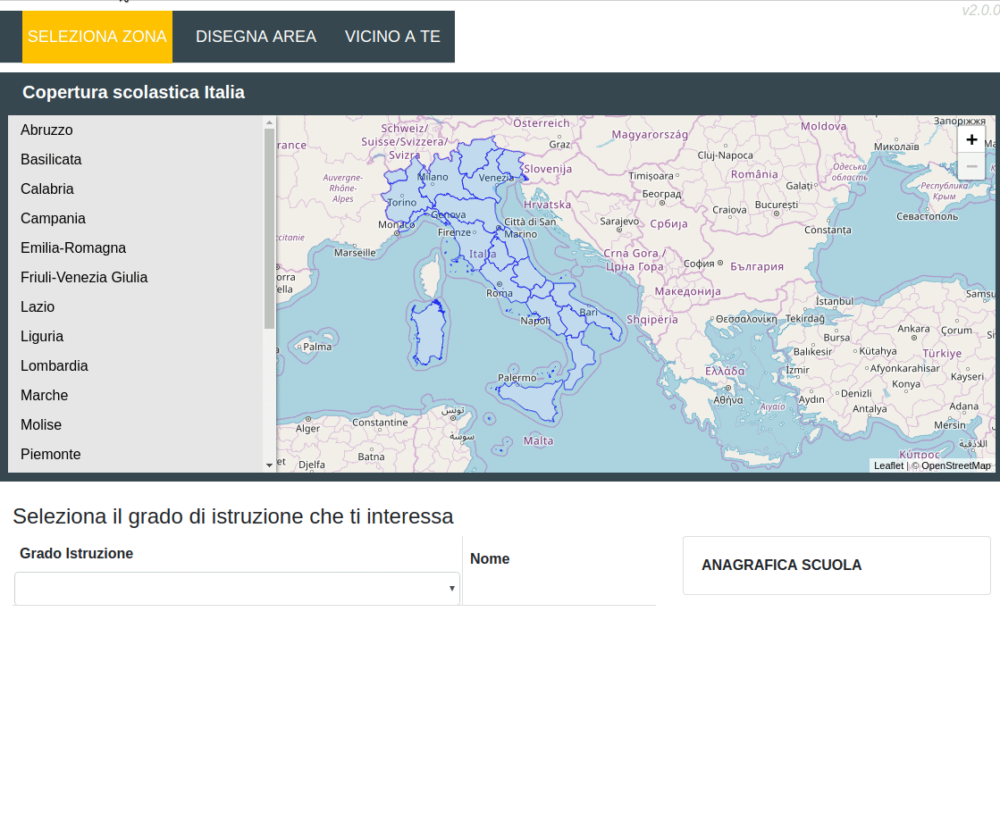

# osm4schools

# Config

Define this global vars before include bundle.js in the html page:

```
<script>
window.baseUrlPro = "https://api-test.smartcommunitylab.it/t/sco.cartella/";
window.aacBaseUrl = "https://am-dev.smartcommunitylab.it/aac/eauth/authorize?";
window.aacRedirect = location.href;
window.aacRedirectLogout = 'login.html';
window.aacClientId = '69b61f8f-0562-45fb-ba15-b0a61d4456f0';
window.aacMatchPath = "/(asl|cs)-stats/";
</script>
```

# Use

## Debug
```
npm install
npm start
```
open index.html in your browser

## Build
```
npm run build
```



